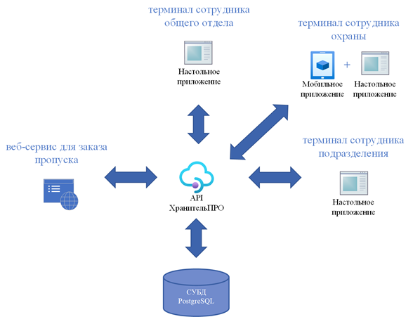

# Guardian Pro

Модуль по организации контроля физического доступа к значимому объекту “ХранительПРО”
Любой объект КИИ предполагает пропускной режим на предприятие, независимо от периметра контролируемой и опасной зон. Модуль “ХранительПРО” направлен на организацию пропускного режима и включает в себя: 
1. Веб-сервис для заказа пропуска на предприятие для гостей и экскурсионных групп;
2. Терминал сотрудника общего отдела для формальной проверки поданной заявки;
3. Терминал сотрудника охраны для реализации пропускного режима;
4. Терминал сотрудника подразделения для учета посещений. 

    

## Установка

Для запуска сервиса необходимо:

1. Перейти в Releases установить скрипт базы данных и source code.
2. Развернуть скрипт в базе.
3. Запустить проект API и запустить его через IDE.
4. Как только сервер API запустился, можно запускать все остальные части сервиса